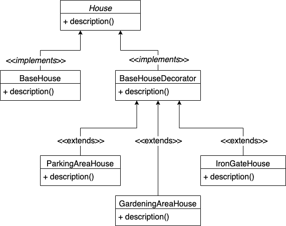

# Decorator Pattern examples using Test Driven Development

## Example (House):
- There is a client, who wants to build one house.
- In that house, he needs only one bedroom along with a hall and kitchen.
- Client wants to add a parking area to our house to store vehicles.
- Client again wants to add a gardening area to increase greenery.

## Class Diagram:

